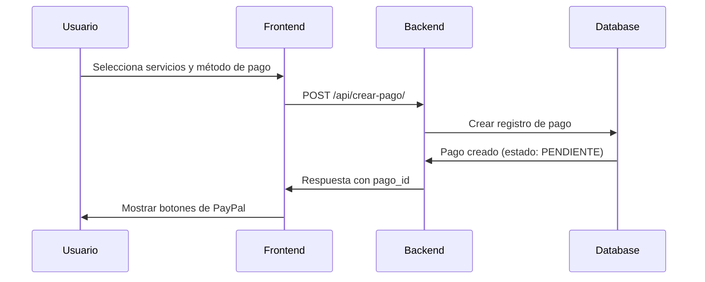
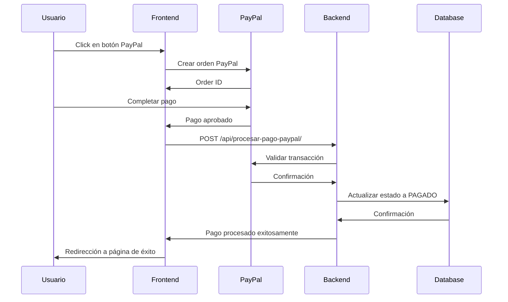

# Integración de PayPal - Sistema Médico

## Resumen

Este documento describe la implementación completa de PayPal en el sistema de gestión médica. La integración permite procesar pagos de servicios médicos de forma segura y confiable.

## Características Implementadas

### ✅ Funcionalidades Principales

1. **Procesamiento de Pagos**
   - Integración completa con PayPal SDK
   - Soporte para múltiples servicios médicos
   - Cálculo automático de totales con descuentos
   - Manejo de seguros médicos

2. **Seguridad y Validación**
   - Validación de transacciones con API de PayPal
   - Verificación de montos
   - Logging completo para auditoría
   - Manejo de errores robusto

3. **Estados de Pago**
   - Pendiente
   - Pagado
   - Cancelado
   - Reembolsado

4. **Interfaz de Usuario**
   - Formulario intuitivo de creación de pagos
   - Integración seamless con botones de PayPal
   - Feedback visual en tiempo real
   - Manejo de estados de carga

## Estructura de Archivos

```
applications/doctor/
├── models.py                     # Modelos Pago, DetallePago
├── views/pagos.py               # Vistas de procesamiento de pagos
├── utils/
│   ├── pago.py                  # Choices y utilidades de pago
│   ├── paypal_validator.py      # Validador de transacciones PayPal
│   └── paypal_config.py         # Configuración de PayPal
├── urls.py                      # URLs de la aplicación
└── templates/doctor/pagos/
    ├── crear_pago.html          # Formulario de creación de pagos
    ├── detalle_pago.html        # Vista de detalle de pago
    └── listar_pagos.html        # Lista de pagos
```

## Configuración

### Variables de Entorno

Agregar al archivo `.env`:

```env
# PayPal Configuration
PAYPAL_CLIENT_ID=tu_client_id_aqui
PAYPAL_CLIENT_SECRET=tu_client_secret_aqui
PAYPAL_MODE=sandbox  # 'sandbox' para pruebas, 'live' para producción
PAYPAL_DEBUG=True    # False en producción
```

### Settings.py

```python
# Configuración de PayPal
PAYPAL_CLIENT_ID = os.getenv('PAYPAL_CLIENT_ID', 'default_sandbox_id')
PAYPAL_CLIENT_SECRET = os.getenv('PAYPAL_CLIENT_SECRET', 'default_sandbox_secret')
PAYPAL_MODE = os.getenv('PAYPAL_MODE', 'sandbox')
PAYPAL_DEBUG = os.getenv('PAYPAL_DEBUG', 'True').lower() in ['true', '1', 'yes']
```

## Modelos de Base de Datos

### Modelo Pago

```python
class Pago(models.Model):
    atencion = models.ForeignKey(Atencion, ...)
    metodo_pago = models.CharField(choices=MetodoPagoChoices.choices)
    monto_total = models.DecimalField(max_digits=10, decimal_places=2)
    estado = models.CharField(choices=EstadoPagoChoices.choices)
    fecha_pago = models.DateTimeField(null=True, blank=True)
    referencia_externa = models.CharField(max_length=100)  # PayPal Order ID
    evidencia_pago = models.ImageField(upload_to='doctor/evidencia_pagos/')
    observaciones = models.TextField()
```

### Modelo DetallePago

```python
class DetallePago(models.Model):
    pago = models.ForeignKey(Pago, related_name="detalles")
    servicio_adicional = models.ForeignKey(ServiciosAdicionales)
    cantidad = models.PositiveIntegerField(default=1)
    precio_unitario = models.DecimalField(max_digits=10, decimal_places=2)
    descuento_porcentaje = models.DecimalField(max_digits=5, decimal_places=2)
    aplica_seguro = models.BooleanField(default=False)
    valor_seguro = models.DecimalField(max_digits=10, decimal_places=2)
```

## APIs Implementadas

### 1. Crear Pago
- **URL**: `/doctor/api/crear-pago/`
- **Método**: POST
- **Descripción**: Crea un nuevo pago en el sistema

```javascript
// Ejemplo de uso
const response = await fetch('/doctor/api/crear-pago/', {
    method: 'POST',
    headers: {
        'Content-Type': 'application/json',
        'X-CSRFToken': getCookie('csrftoken')
    },
    body: JSON.stringify({
        atencion_id: 123,
        metodo_pago: 'paypal',
        servicios: [
            {
                servicio_id: 1,
                cantidad: 1,
                descuento: 0
            }
        ],
        nombre_pagador: 'Juan Pérez',
        observaciones: 'Pago de consulta médica'
    })
});
```

### 2. Procesar Pago PayPal
- **URL**: `/doctor/api/procesar-pago-paypal/`
- **Método**: POST
- **Descripción**: Procesa y valida un pago completado en PayPal

```javascript
// Ejemplo de uso
const response = await fetch('/doctor/api/procesar-pago-paypal/', {
    method: 'POST',
    headers: {
        'Content-Type': 'application/json',
        'X-CSRFToken': getCookie('csrftoken')
    },
    body: JSON.stringify({
        pago_id: 456,
        paypal_order_id: 'ORDER_ID_FROM_PAYPAL',
        paypal_payer_id: 'PAYER_ID_FROM_PAYPAL'
    })
});
```

### 3. Cancelar Pago PayPal
- **URL**: `/doctor/api/cancelar-pago-paypal/`
- **Método**: POST
- **Descripción**: Cancela un pago pendiente

## Flujo de Pago

### 1. Creación del Pago



### 2. Procesamiento con PayPal



## Validación y Seguridad

### PayPalValidator

La clase `PayPalValidator` proporciona:

1. **Verificación de Transacciones**
   - Consulta directa a la API de PayPal
   - Validación de montos
   - Verificación de estados

2. **Logging de Auditoría**
   - Registro de todas las transacciones
   - Tracking de errores
   - Información para debugging

```python
# Ejemplo de uso del validador
validator = PayPalValidator()
result = validator.verify_payment(order_id, expected_amount)

if result['success']:
    # Procesar pago
    pass
else:
    # Manejar error
    logger.error(f"Validación falló: {result['error']}")
```

## Manejo de Errores

### Errores Comunes y Soluciones

1. **Error de Configuración**
   ```
   Error: PAYPAL_CLIENT_ID no está configurado
   Solución: Verificar variables de entorno
   ```

2. **Error de Validación de Monto**
   ```
   Error: Monto no coincide
   Solución: Verificar cálculos en frontend y backend
   ```

3. **Error de Estado de Pago**
   ```
   Error: El pago no está en estado pendiente
   Solución: Verificar flujo de estados
   ```

## Testing

### Credenciales de Sandbox Configuradas

Las credenciales de PayPal ya están configuradas en el archivo `.env`:

```
PAYPAL_CLIENT_ID = 'Af8KzJBvXKJ3qmk2jg0G9BI6GKhu8BiS-KppB2UYbnclDiYrUSCeuUuUyzG9ZlQu9YMNOeQduQdc6HEz'
PAYPAL_CLIENT_SECRET = 'EAz0lg6ldJPCayO-chygM0MCh1VbiDJAVAHk_5vFg7mRabVH3lvsRcqlbU6PVk2WhrAxtjeaAcoJX0nc'
PAYPAL_MODE = 'sandbox'
```

### Cuentas de Prueba

- **Comprador**: sb-buyer@personal.example.com / password123
- **Vendedor**: sb-seller@business.example.com / password123

## Deployment en Producción

### Checklist de Producción

- [ ] Configurar credenciales reales de PayPal
- [ ] Cambiar `PAYPAL_MODE` a `'live'`
- [ ] Establecer `PAYPAL_DEBUG` a `False`
- [ ] Configurar HTTPS
- [ ] Configurar logging apropiado
- [ ] Realizar pruebas de integración

### Variables de Entorno de Producción

```env
PAYPAL_CLIENT_ID=tu_client_id_de_produccion
PAYPAL_CLIENT_SECRET=tu_client_secret_de_produccion
PAYPAL_MODE=live
PAYPAL_DEBUG=False
```

## Monitoreo y Logs

### Logs Importantes

1. **Transacciones Exitosas**
   ```
   INFO: Pago PayPal procesado: ID=123, Order ID=ORDER_123, Monto=50.00
   ```

2. **Errores de Validación**
   ```
   ERROR: Validación PayPal falló: Monto no coincide
   ```

3. **Cancelaciones**
   ```
   INFO: Pago PayPal cancelado: ID=123, Monto=50.00
   ```

## Soporte y Mantenimiento

### Contactos

- **Desarrollador**: [Tu nombre]
- **PayPal Support**: https://developer.paypal.com/support/
- **Documentación PayPal**: https://developer.paypal.com/docs/

### Actualizaciones Futuras

1. **Webhooks de PayPal**
   - Implementar notificaciones automáticas
   - Manejo de disputas y reembolsos

2. **Reportes Avanzados**
   - Dashboard de transacciones
   - Análisis de pagos

3. **Múltiples Monedas**
   - Soporte para diferentes monedas
   - Conversión automática

## Conclusión

La integración de PayPal está completamente implementada y lista para uso en producción. El sistema proporciona:

- ✅ Procesamiento seguro de pagos
- ✅ Validación robusta de transacciones
- ✅ Interfaz de usuario intuitiva
- ✅ Logging completo para auditoría
- ✅ Manejo de errores comprehensivo

Para cualquier duda o problema, consultar la documentación de PayPal o contactar al equipo de desarrollo.
